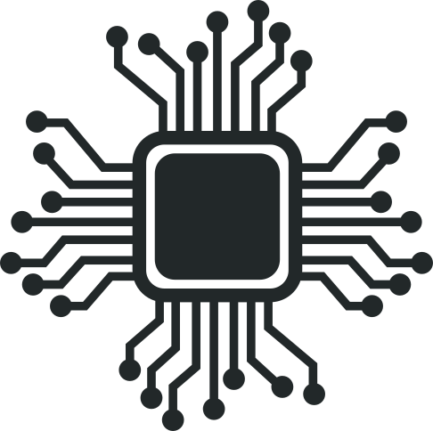
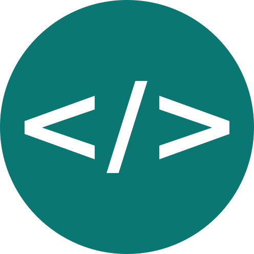

Title: Sobre
Date: 2019-10-20 09:20
Author: Locobots

    <section class = "card_view ">
        
 
            

                <h2>Locobots</h2>
                A Equipe LocoBots da Universidade Federal de Ouro Preto (UFOP), é uma organização sem fins lucrativos, formada por estudantes de todos os cursos do Campus ICEA. Organizada com objetivo educacional,  visa pôr em prática os conhecimentos teóricos adquiridos em sala de aula. 
            

        

    </section>
    <section class = "card_view" >
        

            
            

                <h2>Missão</h2>
                Agregar competências, estimular o conhecimento e crescimento dos membros, para ser a melhor em competições robóticas.
            

        

        

            
            

                <h2>Visão</h2>
                Ser referência em robótica na UFOP.
            

        

        

            
            

                <h2>Valores</h2>
                    Respeito,  
                    Comprometimento,  
                    Pro-atividade,  
                    Qualidade,  
                    Sinergia  
                    Orgulho de ser LocoBots
            

        

    </section>
    <section class="card_view">
        

            
            

                <h2>Projetos</h2>
            

            

                

                    
                    

                        <h2>Robótica</h2>
                            Fabricação de peças, montagem e programação de robos para cometições na modalidade segue linha, sumô 500g e Lego sumô 1kg
                    

                

                

                    
                    

                        <h2>Software</h2>
                            Contrução de simulações utilizando a plataforma Unity 3D e desenvolvimento de softwares voltados a automação 
                    

                

                

                    
                    

                        <h2>Educação</h2> 
                            Promoção do Projeto Robótica sustentável levando a robótica vinculada à conscientização ambiental para alunos do ensino médio de escolas públicas
                    

                

            

        
  
    </section>
    <section class="cartao">
        

            
            
            
        
 
        

            
            
            
        

    </section>
    <section class="card_view">
        

            
            

                <h2>Localização e Contato</h2>
                Você pode nos encontrar no <a style="color: white" href="https://www.google.com/maps/place/Instituto+de+Ci%C3%AAncias+Exatas+e+Aplicadas+-+ICEA%2FUFOP/@-19.8361918,-43.1677057,15z/data=!4m2!3m1!1s0x0:0x55a7ef3c198b9753?sa=X&ved=2ahUKEwjj8eCZvunnAhWME7kGHTtfB3sQ_BIwC3oECA8QCw">Instituto de Ciências Exatas e Aplicadas - ICEA/UFOP</a> em João Monlevade. Para mais informações entre em contato por nossas redes sociais
            

        

    </section>

    <section class="bg-paralax" style = "background-image:url('../images/equipe/equipe.jpg');">
    </section>
    
"Dê asas aos loucos e eles darão vida às máquinas"

